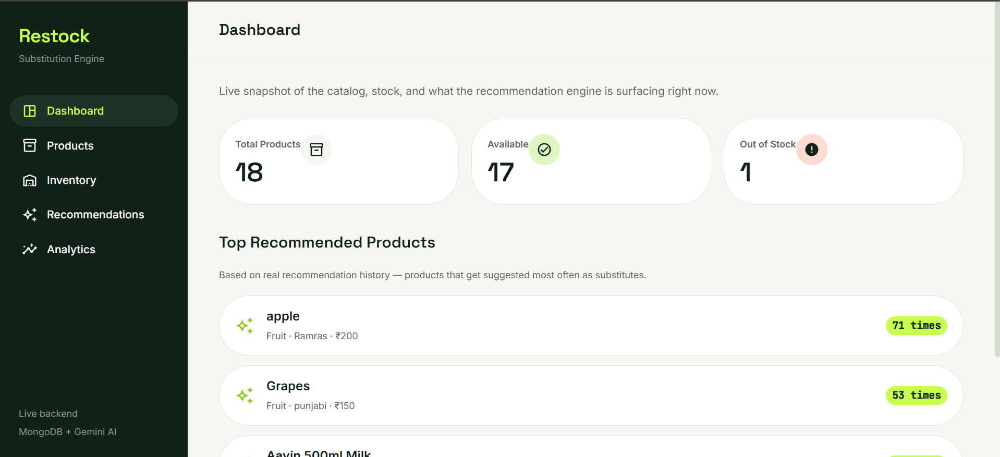
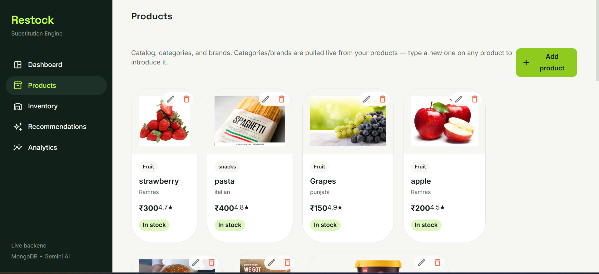
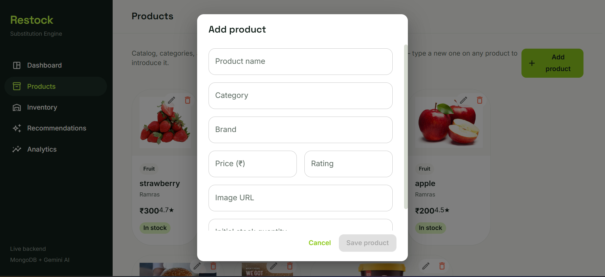
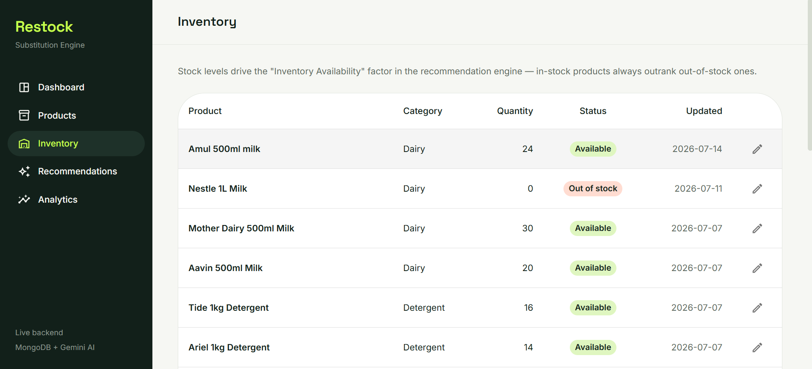
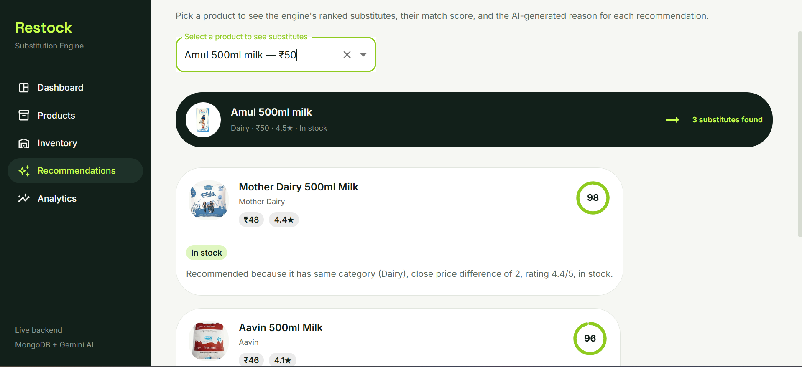
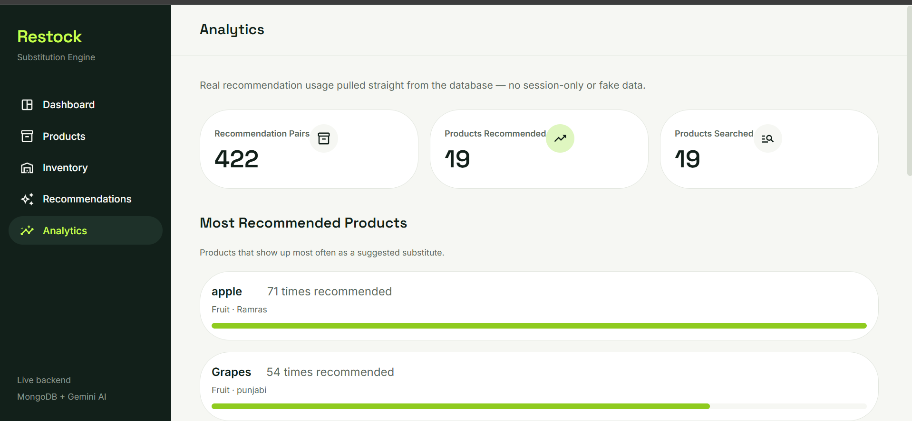

# Restock — Smart Substitution & Product Recommendation Engine

A full-stack recommendation system inspired by quick-commerce platforms (Zepto, Blinkit, Swiggy Instamart) that suggests intelligent product substitutes based on category, price, rating, and real-time inventory — with AI-generated, human-readable explanations for every recommendation.

**Live demo:** https://recommendation-engine-frontend-kappa.vercel.app

> Backend is hosted on Render's free tier, which sleeps after 15 minutes of inactivity. The first request after idle may take 30–50 seconds to wake up — this is expected, not a bug.

---

## Screenshots

### Dashboard
Live stats and a real, data-driven "Top Recommended Products" list — no mock or arbitrary sampling.



### Products
Full catalog with inline add/edit/delete. Categories and brands are pulled live from real product data.





### Inventory
Stock levels editable in place — directly feeds the recommendation engine's availability scoring.



### Recommendations
Pick any product to see ranked substitutes with a match-score ring and an AI-generated explanation for each.



### Analytics
Real usage tracking — most recommended products and search trends, computed from live recommendation history.



---

## Repositories

| Part | Repo | Stack |
|---|---|---|
| Frontend | [Recommendation-engine-Frontend](https://github.com/shubhutf/Recommendation-engine-Frontend) | React (Vite), Material UI, React Router |
| Backend | [Recommendation-engine-backend](https://github.com/shubhutf/Recommendation-engine-backend) | Node.js, Express, MongoDB (Mongoose), Gemini API |

---

## Features

### 📊 Dashboard
Live snapshot of the catalog — total/available/out-of-stock product counts, and a **Top Recommended Products** list pulled from real recommendation usage history (not a static or arbitrary sample).

### 📦 Product Management
Full CRUD on the product catalog — add, edit, delete products. Categories and brands are derived live from existing products (typing a new one on a product introduces it — no separate management screen needed).

### 🏬 Inventory Management
View and edit stock levels per product. In-stock status directly feeds the recommendation engine's ranking.

### ✨ Recommendation Engine
Pick any product to see its ranked substitutes, computed with a weighted scoring formula:

```
Match Score = 40% Category Match
            + 20% Price Similarity
            + 20% Rating
            + 20% Inventory Availability
```

Each recommendation displays its match score as a visual ring, plus a natural-language explanation of *why* it was recommended.

### 🤖 AI Explanation Module
Every recommendation's explanation is generated by **Google Gemini** (`gemini-flash-latest`), given the source product, the recommended product, and the scoring breakdown. If the AI service is unavailable (rate limit, missing key, network issue), the backend automatically falls back to a rule-based template — so the feature never breaks, it just degrades gracefully.

Note: the AI explains *why* a recommendation was made — it does not decide *which* products get recommended. Ranking is fully deterministic and rule-based (see formula above), keeping the system transparent and auditable.

### 📈 Analytics
Real usage tracking, not session-only mock data:
- **Most Recommended Products** — which products get suggested most often as substitutes
- **Recommendation Trends** — which products people most often search substitutes for
- Recommendation pair count grows with every real search, logged directly to MongoDB

---

## Tech Stack

**Frontend**
- React 18 (Vite)
- Material UI (MUI) 6
- React Router 6
- Axios

**Backend**
- Node.js + Express
- MongoDB Atlas (Mongoose)
- Google Gemini API (`gemini-flash-latest`) for AI explanations
- Joi for request validation
- Helmet, CORS, Morgan

---

## Architecture Notes

- **Products** and **Inventory** are separate MongoDB collections, matching the intended data model — stock levels are never embedded directly in product documents.
- The frontend's API layer (`src/mockApi/client.js`) is function-name-matched to the backend's real controller functions (`getAllProducts`, `createProduct`, `getRecommendations`, etc.), so integrating real endpoints required no changes to any page component — only the API layer's internals.
- Recommendation events are logged to a `recommendations` collection on every real search, powering the Analytics page with genuine usage data rather than a static snapshot.

---

## Running Locally

### Backend
```bash
git clone https://github.com/shubhutf/Recommendation-engine-backend.git
cd Recommendation-engine-backend
npm install
```

Create a `.env` file:
```
MONGODB_URI=your_mongodb_connection_string
PORT=5000
GEMINI_API_KEY=your_gemini_api_key
```

```bash
npm run dev
```

### Frontend
```bash
git clone https://github.com/shubhutf/Recommendation-engine-Frontend.git
cd Recommendation-engine-Frontend
npm install
```

Create a `.env` file:
```
VITE_API_BASE_URL=http://localhost:5000/api/v1
```

```bash
npm run dev
```

---

## API Endpoints

| Method | Endpoint | Description |
|---|---|---|
| GET | `/api/v1/products` | List all products (paginated) |
| POST | `/api/v1/products` | Create a product |
| PUT | `/api/v1/products/:id` | Update a product |
| DELETE | `/api/v1/products/:id` | Delete a product |
| GET | `/api/v1/inventory` | List all inventory records |
| POST | `/api/v1/inventory` | Create an inventory record |
| PUT | `/api/v1/inventory/:id` | Update stock quantity |
| GET | `/api/v1/recommendations/:productId` | Get ranked substitutes + AI explanations for a product |
| GET | `/api/v1/analytics/summary` | Get real recommendation usage stats |
| GET | `/api/v1/health` | Health check |

---

## Deployment

- **Backend:** Render (free tier)
- **Frontend:** Vercel

Environment variables are configured per-platform (Render dashboard / Vercel project settings) — never committed to the repo.

---

## Known Limitations & Future Improvements

- Category/brand lists are derived from existing products rather than managed as standalone entities — sufficient for the current scope, but could become dedicated collections if category-level metadata (e.g. icons, descriptions) is ever needed.
- Recommendation trend data is frequency-based (which products drive the most searches) rather than time-series — no timestamp-based "trend over time" chart, since the backend doesn't currently expose that granularity.
- Deleting a product does not cascade-delete its historical recommendation log entries; the frontend filters out these orphaned references from display, but they remain in the database.
- Gemini's free tier is rate-limited (20 requests/day at time of writing); the local fallback explanation ensures the feature keeps working past that limit.

---

## Team Roles

Built as a group project with role-based ownership, per the original project structure:
- **Frontend Developer** — Dashboard, Product Catalog, Recommendation Pages, Analytics screens
- **Backend Developer** — APIs, Database Design, Inventory Management, Product Management
- **Recommendation & AI Developer** — Recommendation Engine, Ranking Logic, AI Explanation Module, Testing & Documentation
